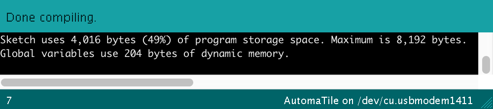

# AutomaTiles as Game Platform

AutomaTiles allow a new type of game play as well as game design, and the following document will give a quick overview as to how to design for AutomaTiles and what their unique capabilities are.

## Overview

First of all, what are AutomaTiles? Each AutomaTile is a "smart" hexagonal tile, designed to be held in the hand or placed next to other tiles on a table. Magnets inside of each AutomaTile allow the hexagonal tile to maintain an organized gridlike structure without needing a board. Each tile has 3 properties:
1. it responds to presses (this is a tactile button press, the entire tile depresses ever so slightly, so players can feel when they have pressed on a tile, not simply touched)
2. it is social, which means it is aware of its neighbors, tiles on other sides, both presence as well as state (explained further below)
3. it is rythmic, can respond to sound (currently treated as a global message, for example a time step forward)

## Outputs

AutomaTiles communicate to the players through RGB illumination and their hue, saturation, brightness, as well as animated properties (i.e. pulsing, blinking, flashing...). Their is only a single uniform illumination for the entire tile, so think of each tile as being able to communicate relatively simple information.
In one example, a tile shows it is in a win condition by blinking rapidly, so all players are aware of the game state.

While illumination is how a single tile communicates to the players, the arrangement of the tiles also communicates something to the players. In one example, the arrangement of 10 tiles into different forms creates different behaviours of the whole. For example, if the tiles are representing trees in a forest fire, a tightly packed set of 10 will spread the fire quicker than a long single file line of tiles(trees). The player can reason this by seeing the arrangement of the board, and conversely, affect it by rearranging the board. Which brings me to inputs.

## Inputs

The simplest of inputs is a press. Each tile acts as a mechanical momentary button. The button can be used in a variety of ways, and can respond to a quick press, a long press, a double press...

The button press can be an input to change the state of a tile, or inform the tile of a users action. For example, in the forest fire ruleset, a single press strikes lightning upon a tile. If the tile is a tree, it will then change state to be on fire, and if it is not a tree, it will simply go on being not a tree, as well as not on fire.

The press can also be used to reveal information contained in a tile. For example, a tile representing a place in a game of minesweeper could reveal that it has a mine under it only when held with a long press. The button press in this case didn't add information to the system but is simply used to reveal information.

## Tile Communication

The tiles communicate with each of their six tile neighbors by receiving information every ~20 times per second. The information passed is in the form of a single integer (0-16). If no tile is present on a single side, the tile reads 0 on that side. (A tile can be present and send 0 as well, but it will be treated the same as space without a tile). What does this mean in simple terms? This means that each tile can tell each neighboring tile that it is in one of roughly 15 states. In the forest fire example, there are 3 states: tree, fire, soil. But what about lightning? that isn't a state, since it only affects the local tile, so it is animated through the illumination, but simply changes the tile's state from tree to fire.

AutomaTiles are setup to do this kind of communication often and reliably, but it is not the only way they can communicate. For longer forms of information, such as passing string-like information, there is a shared data buffer that could be utilized. This is experimental and not refined in the API, so I recommend first trying to rely on simple communication with the dozen or so states afforded above.

## Time

Game time for the tiles can be continuous, evaluating their state 20 times a second, or they can be discrete, evaluating their state only when a step is called. The step can be heard from the microphone or sensed via a pacemaker(special AutomaTile that silently flashes in the same way a metronome clicks).

In the forest fire example, time is discrete, which makes the spread of the fire controlled by the speed of the metronome. One could see this as a game mechanic, where each turn is a click or step forward.

In the game Fracture, a continuous game, the tiles are constantly evaluating their state so they can show players the most up to date representation of the current board state. This results in a board that is quickly responsive to arrangement, while discrete time makes a board that feels responsive to sound, pacemaker, or simply discrete time.

## Random vs. Deterministic

AutomaTiles can respond to their inputs and neighbors deterministically, where they will respond exactly the same way given the same inputs and neighbors everytime. This is the case in the example of Fracture or Game of Life. Players can learn how tiles will behave given a certain arrangement because of this deterministic ruleset.

Games often use randomness for a bit of chance involved in each move. A dice roll, or a weighted random value can be very useful in creating suspense or capturing the real world uncertainty.

Randomness can also be used with AutomaTiles with a bit of care and caution. Randomness is currently based on the internal clock of the ATtiny, which can provide a good enough source for a dice roll. In the example of the forest fire, each tile (plot of land) has an n% chance of growing a tree. That percent increases with the number of neighboring trees, to represent fertile ground, but it is random none-the-less. The caviat with randomness and AutomaTiles is that players must feel like the tiles are giving signal, not simply noise. If a player can't understand why a tile is behaving in the way it is, it will be confusing for everyone. That said, it is not a technical limitation, if you want a tile to be a random different color every time you press it, that is an easy program to write.

## Memory

While tiles can maintain a bit of a memory or history of what they have done, neighbors they've had, or how much time has passed, this is limited and it is important to remember that if this isn't transparent to the player, it will be very confusing. However, there will be elegant solutions in which a bit of stygmergy might just seep its way into a game and shed light on a beautiful invisible system that lies just beneath the surface.
(more on program space below)

## Trickiness

As you might have noticed, you have complete control over the way a tile displays itself to the player and the state a tile is actually in. It might be useful to have many states an only 2 visibly different appearances to the players. Conversely, it might be useful to have only two states and show many different illuminations.

The possibilities are many, feel free to look through the samples, they are only a few, but cover a couple of use cases.

Please feel free to ask about features, and if I didn't cover something that is in the API, I should, so point it out, it belongs here, too!

## Tech Details (for the game designer)

Each tile has it's own brain(attiny) with which it can run its own set of instructions. The examples I have given so far have the exact same code on every tile and the properties of the tiles together could be referred to as _emergent_. Game design with different code on some tiles vs others is also possible but might requires a skin or mark of some sort to differentiate the tiles (if the colors don't already suggest seperation).

### Memory

The ATtiny84 contains 8k of memory. The AutomaTiles firmware (or core library) takes up just under half of this space (~4k). That leaves an additional 4k for you to program your application.

The forest fire example uses ~5k memory (i.e. that application is only about 1k)

The game Fracture uses ~6k memory (... 2k application)

Additionally, there are 512 bytes of dynamic memory or RAM, which will be used for your global variables as well as your stack. If you use up all of that space with global variables, there will be no room for the stack and so weird sh...stuff will happen. Here is a nice breakdown of [memory management on AVR](http://thegaragelab.com/conserving-memory-on-an-avr/).

The space is limited, which suggests simple rules and straightforward code, which is beneficial to the players as well, since the aggregate always feels more complex than the single tile. When programming the tiles, optimizations for space can be made such as being specific about the types of variables. For example, using a `uint8_t` (1 byte... 8 bits) is a space efficient way to hold numbers 0-255, while using an `int` or an `uint16_t`(2 bytes... 16 bits) might be wasteful.

At first this task of memory management could seem daunting, but in practice, I have found the exercise of being concise and clever with code quite rewarding. Additionally, the Arduino IDE will let you know exactly how much space you are using everytime you press compile. If you open up a blank AutomaTile sketch and press compile, you will see that the sketch is ~4k (49%)

